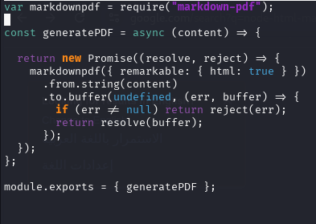

* Challenge Title: `Dark Runes`.
* Category: `Web`.
* Difficulty: `Easy`.
* Points: `40`
* Summary: `This challenge based-on privilege escalation into admin account to use built-in vulnerability in markdown-pdf 11.0.0 library`.

### Challenge Description: 
  * Survivors find a battered laptop in the rubble. Powering it up, they discover a cryptic software interface from an ancient architecture firm, hinting at vital blueprints. They must crack its security protocols. Undeterred, they race against time.

### Website Overview:
  * ### 1. Login Page:
    * 
  * ### 2. Register Page:
    * 
  * ### Create Document Page: 
    * 
### Solution Steps:
  * ### 1. Privilege Escalation my account to get `admin` access.
    * There's logic bug in session function `generateCookie` function.
      * 
      * 
    * `generateCookie` function generates base64-encode for JSON object `{username, id}` (First part of the session).
    * Then pass this encoded string to `signString` function to make signature (Second part of the session).
    * Return cookie value in this format `{base64-encoded String}-{Signature}`, and put generated cookie in your browser with cookie name `user`.
    * The Application uses `signString` function to generate created document's signature.
    * So, we can but our base64-encoded object with username `admin` to make vaild signature and valid cookie to admin account.
      * 
        * Create base64-encode of our object with admin username.
      * 
      * Then create document with my base64-encoded string to make valid signature.
      * Put my base64-encoded string in first part of the cookie and put the my signature in second part of the cookie, and refresh the page, boom we got an admin access.

    * ### 2. Exploit the vulnerability in `markdown-pdf 11.0.0` library.
      * 
      * The application generates pdf file with library called `markdown-pdf` and it's version is `11.0.0`.
      * This version is vulnerable to `Local-File-Read` via `Server-Side-XSS` ==> `CVE-2023-0835`.
      * I found endpoint in the source code without content sanatization to can use exploit `/document/debug/export`.
        * 
      * This endpoint requires `admin access` (We have this) and `access pass` (We don't have this).
      * `generateAccessCode` is the function that generates access code.
        * 
        * This function creates access code of four digits.
        * The Application changes access code in every request.
        * If the access code length is less than for digits, the application fill it with `0` ==> `0023` for example.
        * This function can be brute-forced.
        
      * ### 3. Create python script to automate exploit.
        * 
        * This script creates `POST` request to vulnerable endpoint with expliot code and static `access_pass` and your `admin account` cookie.
        * The script uses the `admin` cookie to bypass `isAdmin` and `isAuthenticated` conditions.
        * Use static `access_pass` and loop of requests, If the application's `Generated access_pass` is equal to your `Static access_pass`, The request will succeed and create `PDF` file has challenge `FLAG`.
        * 