* Challenge: `Desires`.
* Category: `Web`.
* Difficulty: `Easy`.
* Summary: This challenge was based on login problem let me access the `ADMIN` page.

* ### Downloads The White Box To Review Source Code :
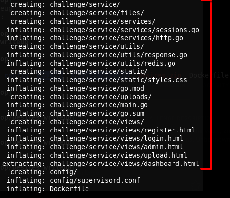 

* I focused on two files `http.go` and `sessions.go`

* ### Let's start `sessions.go` analysis :
    * This file has only three functions.
* 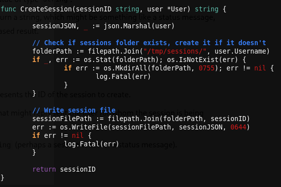
* 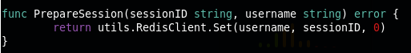
* 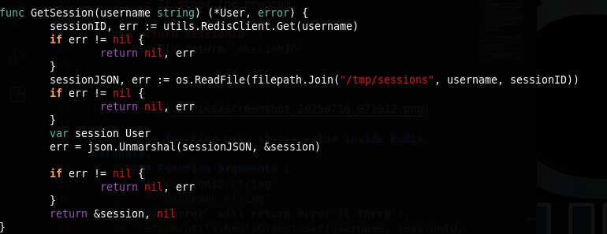
    * `CreateSession` Function :
        * This function takes two arguments `sessionID` and `user`.
        * Convert `user` object's data into JSON Format and store it into variable called `sessionJSON`.
        * Create session file in this path if it doesn't exist `/tmp/sessions/{username}`.
        * Store session's JSON data in the file.
        * finally return `sessionID` if everything goes well, but if anything goes wrong, the script won't be completed.
    * `PrepareSession` Function :
        * This function takes two arguments `sessionID` and `username`.
        * This function sets a key (username) in `redis` database and it's value will be `sessionID`.
        * This function will return error if anything goes wrong.
    * `GetSession` Function :
        * This function takes only one argument `userame`.
        * Get `sessionID` by `username` key from `Redis` database and return `error` if anything goes wrong.
        * Then try to access session file content (JSON data) in this path `/tmp/sessions/{username}/{sessionID}` and return error if anything goes wrong.
        * Convert JSON data from session's file into Golang data type and store into variable called `session` as an Object and return error if anything goes wrong.
        * Finally return user data Object if anything goes well.

* ### Let's Analyze `Login` Proccess Function :
* 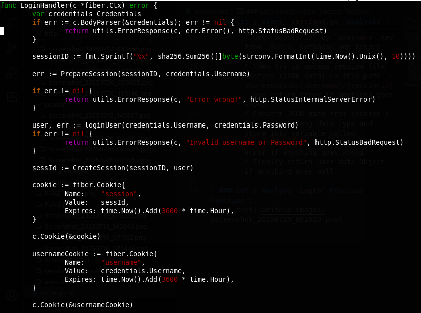
    * Create `sessionID` with current time.
    * Put the session in the `Redis` database with `username` as a key by `PrepareSession` function.
    * Then try to login the user if `username` and `password` are true and put the user's JSON Data in this path `/tmp/session/{username}/{sessionID}` using `CreateSession` and put the `cookie` in the browser under name `session` and it's value will be `sessionID` and another `cookie` in the browser under name `username` in it's value will be `username` of the user.
    * Finally if anything goes well, the script will redirect the user to `/user/upload` to upload `you can upload only zip files in this page and it'll be decompressed in this path "/app/service/files/{username}/{your compressed file inside zip}"`

* 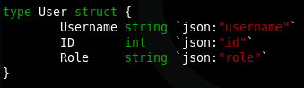
    * These're the data comes from JSON file of the session in this path `/tmp/sessions/{username}/{sessionID}`.

* 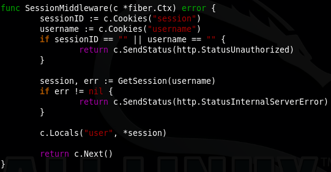
    * This function only runs on amy path under `/user` directory.
    * This function uses `GetSession` function that reads JSON data in this path `/tmp/sessions/{username}/{sessionID}`
    * ### NOTE : 
        * I'll use this function to make `Role` in user Object as an `admin` to access `admin page` in `/user/admin`
        * This is the term to see `admin` page :
            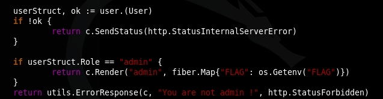

* ### Exploit Steps :
    * First, we need to make file to contain this data.
        * `{"username":"your username", "id":1, "role":"admin"}`, this file name will session we generate later becuase the `sessionID` based on time, so we can bruteforce it and make our sessions with script like that.
            * 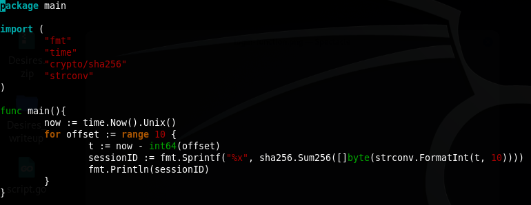
            * I made this script to make sessions 10 seconds before.
    * Regiseter user called `test` or whatever username you want.
    * Login with your username and password and go to upload page.
    * Open new login page to start your exploit.
    * Send login request like that `../../../../../../../app/service/files/test`.
        * 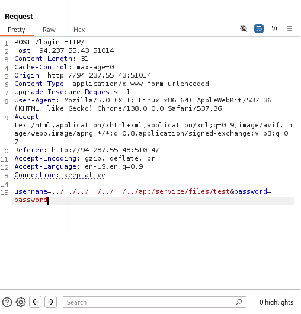
    * once you send the request, in same second run the script to generate `sessionID`.
        * 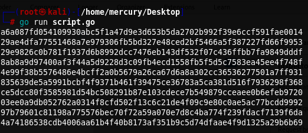
    * Rename you file that contains JSON data to one of these sessions and compress it in zip file and upload it, now it'll be decompressed and stored in this path `/app/service/files/{username}/{sessionID}`
    * Now you can request `/user/admin` to get `FLAG` from admin page.
        * 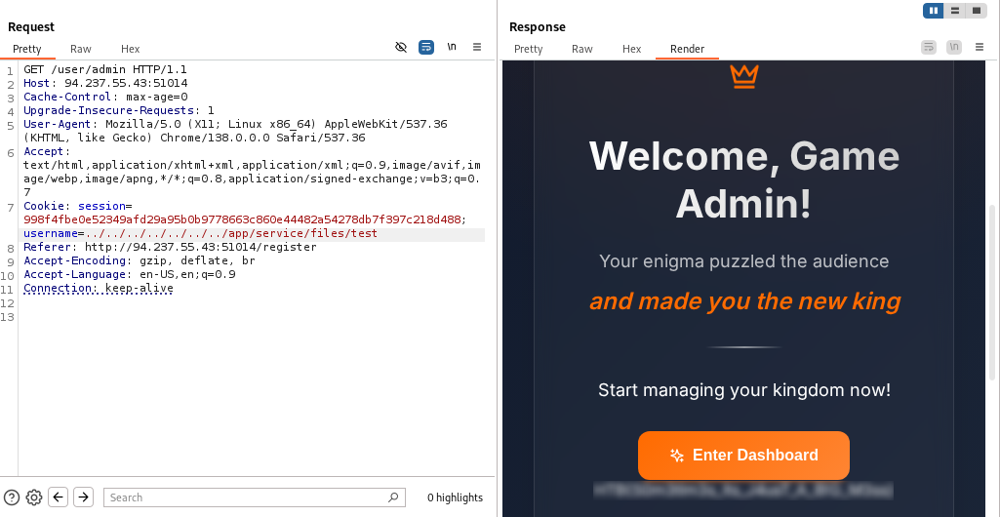

* ### Exploit Explaination :
    * Once you've send fake login request with this username `../../../../../../../app/service/files/{username}`.
    * `PrepareSession` will run automatically and put your whole username inside the redies and it's value will be `sessionID` depends on current time (seconds number) what ever the credentails are true or false.
    * and in the same second you run the your script to generate session, so also you have the same session.
    * Once you upload your file with the same session name and try to visit `/user/admin` that happens.
    * `SessionMiddleware` function uses `GetSession` function to get an Object that contains `user` data from the JSON file.
    * `GetSession` function will take your `username` and `sessionID` and try to read the file from this path `/tmp/sessions/{username}/{sessionID}`, but once you put username as file, you've changed location of the file that contains user data Object to your file with `"role":"admin"` 
        * `/tmp/session/../../../../../../../app/service/files/{username}/{sessionID}`.
    * The function will see your role `admin`, once you requested `admin page` it'll show you `FLAG`.
